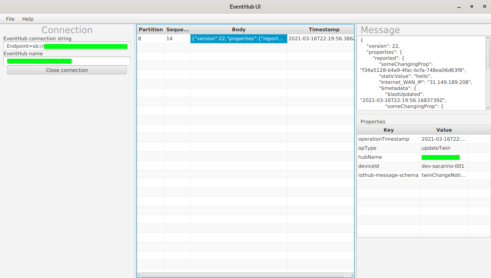

# EventHub UI
A graphical interface to watch your EventHub in real time. Useful to know what is inside your Azure EventHub with zero code.

## Running

EventHub UI is a Kotlin + JavaFX app, built using Maven. To run the app, download the code and then execute:
    $ mvn clean javafx:run

## TODO

Some things missing:

* Store credentials for quick connections
* Send messages
* Search messages